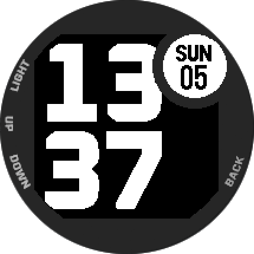

# Watch face for the Garmin Instinct 2S



This watch face is designed specifically for the [Garmin Instinct 2S](https://www.garmin.com/en-US/p/741462/pn/010-02564-11). It is clean, simple, and bold. It shows the time, day of the month, day of the week, and indicates if the battery charge is less than 20%. 

## Usage

To build the watch face, you will need the [Garmin Connect IQ SDK](https://developer.garmin.com/connect-iq/overview/). After installing the SDK you will need to [generate a developer key](https://developer.garmin.com/connect-iq/reference-guides/monkey-c-command-line-setup/) and change the `KEY_PATH` in the `Makefile`.

Create a debug build:

```
make build
```

Run the debug build in the simulator:

```
make run
```

Create a release build:

```
make release
```

Deploy the release build to the watch connected via USB:

```
make deploy
```
